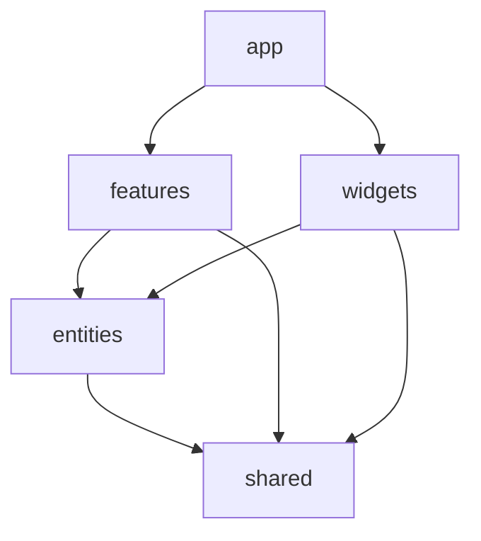

# 🚀 VXD Portfolio

> **Vision eXperience Developer (VXD)** — A premium, high-performance portfolio and blog platform built with the latest web technologies. Powered by **Next.js 16**, **Notion CMS**, and **Tailwind CSS v4**.

---

## 🌟 Overview

### Core Features
- 📝 **Notion CMS Integration**: Manage blog posts directly from Notion
- 🌐 **Internationalization (i18n)**: Full support for Korean (KR) and English (EN)
- 🎨 **Theme Support**: Dark, Light, and System modes
- 🔍 **Search & Filter**: Search by title, filter by tags and groups
- ♾️ **Infinite Scroll**: Smooth pagination with 6 posts per page
- 💬 **Comment System**: Notion-based comments with rate limiting and validation
- 👁️ **View Counter**: Track post views with Notion integration
- 🔗 **Slug-based Routing**: SEO-friendly URLs

### SEO & Performance
- 🎯 **Dynamic Metadata**: Automatic Open Graph and Twitter Card generation
- 🗺️ **Sitemap & Robots.txt**: Auto-generated for search engines
- 📡 **RSS Feed**: RSS 2.0 feed at `/feed.xml`
- ⚡ **Caching Strategy**: 1-hour server-side caching with Next.js
- 🚀 **Speed Insights**: Vercel Speed Insights integration

### Developer Experience
- 🧪 **Testing**: Vitest (unit) + Playwright (E2E)
- 🔄 **CI/CD**: GitHub Actions → Vercel deployment
- 📊 **Analytics**: Google Analytics (GA4), Google Tag Manager
- 💰 **Monetization**: Google AdSense integration

---

## ✨ Premium Features

### 🎨 Visual & Experience
- **Fluid Design System**: A meticulously crafted UI using Tailwind CSS v4, featuring glassmorphism, smooth gradients, and interactive micro-animations.
- **Dark/Light Mode**: First-class support for system-preferred and manual theme switching via `next-themes`.
- **Responsive Mastery**: Tailored experiences for every device, from ultra-wide monitors to mobile screens.
- **Framer Motion**: Dynamic transitions and scroll-based animations for an immersive browsing experience.

### 📝 Headless Blog (Notion)
- **Dynamic Content**: Posts are fetched in real-time from Notion databases with optimized caching.
- **Rich Text Support**: Full rendering of Notion blocks including code syntax highlighting, callouts, and images.
- **Infinite Scrolling**: Performance-optimized pagination for a seamless reading experience.
- **Integrated Comments**: A custom comment system using Notion as a persistent data store.
- **Post Metrics**: Real-time view tracking and engagement analytics.

### 🛠️ Technical Excellence
- **SEO Mastery**: Automated generation of sitemaps, robots.txt, and dynamic Open Graph images.
- **RSS Integration**: Stay connected with an auto-generated RSS 2.0 feed.
- **Analytics & Tracking**: Seamless integration with Google Analytics (GA4) and Tag Manager.
- **Performance Optimized**: Server-side caching (1h TTL) and Vercel Speed Insights for sub-second load times.

---

## 🏗️ Architecture: Feature-Sliced Design (FSD)

The project follows the **FSD** methodology to ensure high scalability and strict isolation of concerns.



- **`app/`**: Application logic, routing, and global providers.
- **`features/`**: User-facing functionalities (e.g., Search, Commenting).
- **`widgets/`**: Complex compositional components (e.g., Header, PostGrid).
- **`entities/`**: Domain-specific business logic and data structures (e.g., Post, Category).
- **`shared/`**: Reusable UI components, hooks, and utility functions.

---

## 📦 Tech Stack

| Layer | Technology |
| :--- | :--- |
| **Core** | [Next.js 16](https://nextjs.org/), [React 19](https://react.dev/) |
| **Styling** | [Tailwind CSS v4](https://tailwindcss.com/), [Lucide Icons](https://lucide.dev/) |
| **Animation** | [Framer Motion](https://www.framer.com/motion/) |
| **CMS** | [Notion API](https://developers.notion.com/) |
| **Localization** | [next-intl](https://next-intl-docs.vercel.app/) |
| **Testing** | [Vitest](https://vitest.dev/), [Playwright](https://playwright.dev/) |
| **Monitoring** | [Vercel Analytics](https://vercel.com/analytics), [GA4](https://analytics.google.com/) |

---

## 🚀 Getting Started

### Prerequisites
- **Node.js**: v20 or higher
- **Package Manager**: `pnpm`
- **Notion**: An integration token and database ID

### Installation

1. **Clone & Navigate**
   ```bash
    git clone https://github.com/cjungwo/vxd-blog.git
    cd vxd-blog/feature
    ```

2. **Environment Setup**
    ```bash
    # Move to the web app directory and setup env
    cp apps/web/.env.example apps/web/.env.local
    # Fill in your NOTION_API_KEY and DATABASE_IDs in apps/web/.env.local
    ```

3. **Install Dependencies**
    ```bash
    pnpm install
    ```

4. **Launch Development**
    ```bash
    # Run all apps or specify filter
    pnpm dev
    # or
    pnpm dev --filter @vxd/web
    ```

---

## 🧪 Quality Assurance

We maintain high code quality through rigorous testing and automated workflows.

```bash
# Run Unit Tests
pnpm test

# Run E2E Tests
pnpm test:e2e

# Playwright UI Mode
pnpm test:ui
```

---

## 📄 License & Author

Copyright © 2026 **Vision eXperience Developer (VXD)**.  
This project is private and proprietary. Unauthorized copying or distribution is prohibited.

---

## 🙏 Credits
- [Next.js Team](https://nextjs.org/) for the incredible framework.
- [Notion](https://notion.so) for being the best headless CMS.
- [Tailwind Labs](https://tailwindcss.com) for CSS superpowers.
