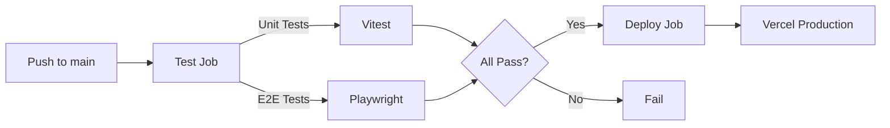

# CI/CD Strategy

GitHub Actions와 Vercel을 활용한 CI/CD 전략 문서입니다.

---

## 1. 개요

| 항목 | 값 |
|------|-----|
| **CI/CD 도구** | GitHub Actions |
| **배포 플랫폼** | Vercel |
| **워크플로우 파일** | `.github/workflows/ci-cd.yml` |

---

## 2. 워크플로우 트리거

```yaml
on:
  push:
    branches: [main]
  pull_request:
    branches: [main]
```

- `main` 브랜치에 Push 시 테스트 + 배포
- `main` 브랜치에 PR 시 테스트만 실행

---

## 3. Jobs

### 3.1 Test Job

1. **Checkout**: 코드 체크아웃
2. **Install pnpm**: pnpm v9 설치
3. **Setup Node.js**: Node.js 20 설정
4. **Install dependencies**: `pnpm install`
5. **Run Unit Tests**: `pnpm test` (Vitest)
6. **Install Playwright**: `playwright install --with-deps`
7. **Run E2E Tests**: `pnpm test:e2e`

### 3.2 Deploy Job

- **조건**: `main` 브랜치 Push 시에만 실행
- **의존성**: Test Job 성공 후 실행

1. **Vercel CLI 설치**
2. **Vercel 환경 Pull**
3. **프로덕션 빌드**
4. **프로덕션 배포**

---

## 4. 환경 변수 (Secrets)

| Secret | 용도 |
|--------|------|
| `NOTION_API_KEY` | Notion API 인증 |
| `NOTION_DATA_SOURCE_ID` | Notion 데이터소스 ID |
| `VERCEL_ORG_ID` | Vercel 조직 ID |
| `VERCEL_PROJECT_ID` | Vercel 프로젝트 ID |
| `VERCEL_TOKEN` | Vercel 배포 토큰 |

---

## 5. 배포 흐름


