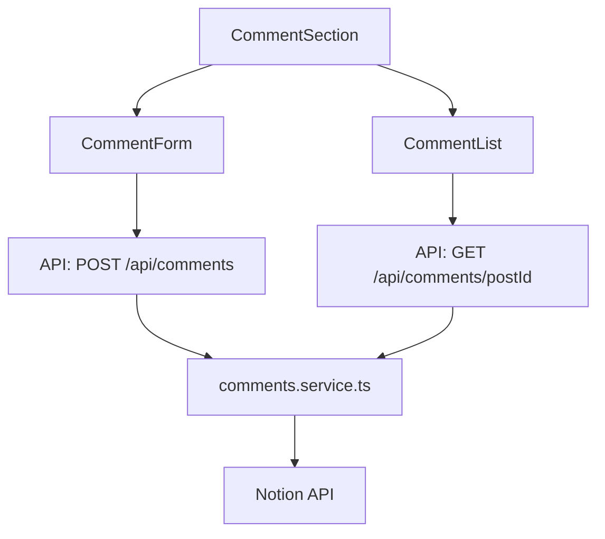

# Comment System Architecture

Notion 기반 댓글 시스템 구현 문서입니다.

---

## 1. 개요

| 항목 | 값 |
|------|-----|
| **저장소** | Notion Database (Comments) |
| **캐싱** | 1분 (60초) |
| **검증** | 클라이언트 + 서버 양측 |
| **상태 관리** | React State (Client Component) |

---

## 2. Notion 데이터베이스 스키마

### Comments Database

| 속성명 | 타입 | 용도 |
|--------|------|------|
| `comment` (title) | Title | 댓글 내용 |
| `post_id` | Relation | 게시물 연결 |
| `status` | Select | 승인 상태 (approved) |
| `created_time` | Created Time | 작성 시간 (자동) |

---

## 3. 환경 변수

```bash
NOTION_COMMENTS_DATA_SOURCE_ID=xxx    # Comments Database ID
```

---

## 4. 컴포넌트 구조



### 4.1 CommentSection (`CommentSection.tsx`)
- **역할**: 댓글 섹션 컨테이너
- **상태 관리**: 댓글 목록, 로딩, 에러
- **기능**: 댓글 fetch, 새 댓글 제출 시 갱신

### 4.2 CommentForm (`CommentForm.tsx`)
- **역할**: 댓글 작성 폼
- **검증**: 
  - 최소 1자, 최대 1000자
  - URL 차단 (정규식)
- **피드백**: 성공/실패 메시지 표시

### 4.3 CommentList (`CommentList.tsx`)
- **역할**: 댓글 목록 렌더링
- **정렬**: 최신순 (created_time DESC)

---

## 5. API Routes

### 5.1 GET `/api/comments/[postId]`
- **용도**: 특정 게시물의 댓글 조회
- **응답**: `{ comments: Comment[] }`
- **캐싱**: `unstable_cache` (60초)

### 5.2 POST `/api/comments`
- **용도**: 새 댓글 생성
- **요청 Body**: `{ postId: string, comment: string }`
- **검증**:
  - 빈 댓글 차단
  - 1000자 초과 차단
  - URL 포함 차단
- **응답**: `{ success: boolean, message?: string, error?: string }`

---

## 6. 서비스 레이어 (`comments.service.ts`)

### 6.1 `getCommentsByPostId(postId)`
- Notion에서 `post_id` Relation으로 필터링
- 1분 캐싱 적용

### 6.2 `createComment(postId, comment)`
- 검증 후 Notion에 페이지 생성
- `status: 'approved'` 자동 설정

---

## 7. 검증 규칙

| 규칙 | 클라이언트 | 서버 |
|------|-----------|------|
| 최소 1자 | ✅ (required) | ✅ |
| 최대 1000자 | ✅ (maxLength) | ✅ |
| URL 차단 | ❌ | ✅ |
| 빈 문자열 | ✅ (trim) | ✅ |

---

## 8. i18n 지원

`messages/[locale].json`에 다음 키 추가:
- `Comments.title`
- `Comments.writeComment`
- `Comments.submit`
- `Comments.noComments`
- `Comments.loadError`
- `Comments.submitSuccess`
- `Comments.submitError`

---

## 9. 통합 위치

댓글 섹션은 게시물 상세 페이지 하단에 통합됩니다.

```tsx
// app/[locale]/[slug]/page.tsx
<CommentSection postId={post.id} />
```
