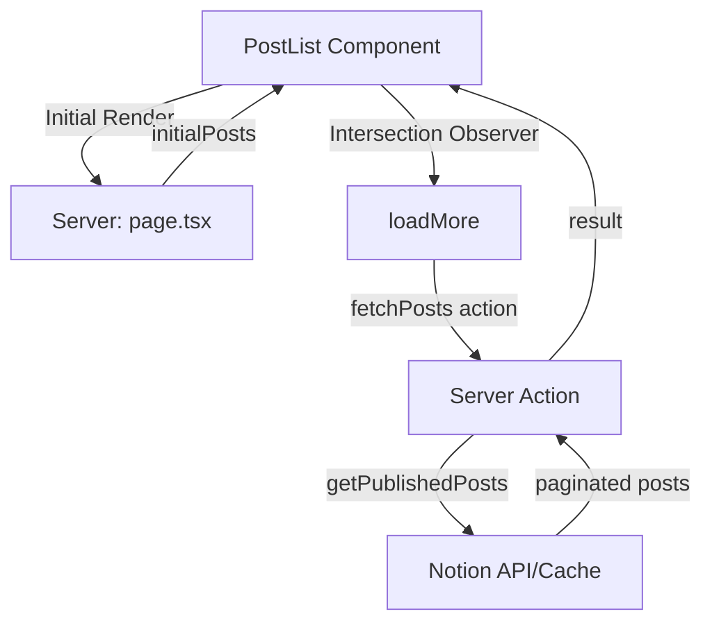

# Infinite Scroll Strategy

무한 스크롤 구현 전략 문서입니다.

---

## 1. 개요

| 항목 | 값 |
|------|-----|
| **페이지당 게시물** | 6개 |
| **컴포넌트** | `PostList.tsx` |
| **서버 액션** | `app/actions.ts` |

---

## 2. 아키텍처



---

## 3. 핵심 로직

### 3.1 서버 액션 (`app/actions.ts`)

```typescript
'use server';

const POSTS_PER_PAGE = 6;

export async function fetchPosts({ page, tag, search, group, locale }) {
  const allPosts = await getPublishedPosts(tag, search, group, locale);
  
  const start = (page - 1) * POSTS_PER_PAGE;
  const end = start + POSTS_PER_PAGE;
  const paginatedPosts = allPosts.slice(start, end);
  const hasMore = end < allPosts.length;
  
  return { posts: paginatedPosts, hasMore };
}
```

### 3.2 클라이언트 컴포넌트 (`PostList.tsx`)

1. **초기 상태**: 서버에서 첫 6개 게시물 전달
2. **Intersection Observer**: 스크롤이 하단에 도달하면 감지
3. **loadMore**: 다음 페이지 데이터 요청
4. **상태 업데이트**: 기존 목록에 새 게시물 추가

---

## 4. Props

```typescript
interface PostListProps {
  initialPosts: BlogPost[];   // 첫 페이지 게시물
  initialHasMore: boolean;    // 추가 로드 가능 여부
  tag?: string;               // 태그 필터
  search?: string;            // 검색어 필터
  group?: string;             // 그룹 필터
  locale?: string;            // 언어 (ko/en)
}
```

---

## 5. 필터 변경 시 동작

필터(tag, search, group)가 변경되면:
1. 게시물 목록 초기화 (`initialPosts`로 리셋)
2. 페이지 번호 1로 리셋
3. `hasMore` 상태 초기화

```typescript
useEffect(() => {
  setPosts(initialPosts);
  setHasMore(initialHasMore);
  setPage(1);
}, [initialPosts, initialHasMore, tag, search, group]);
```
