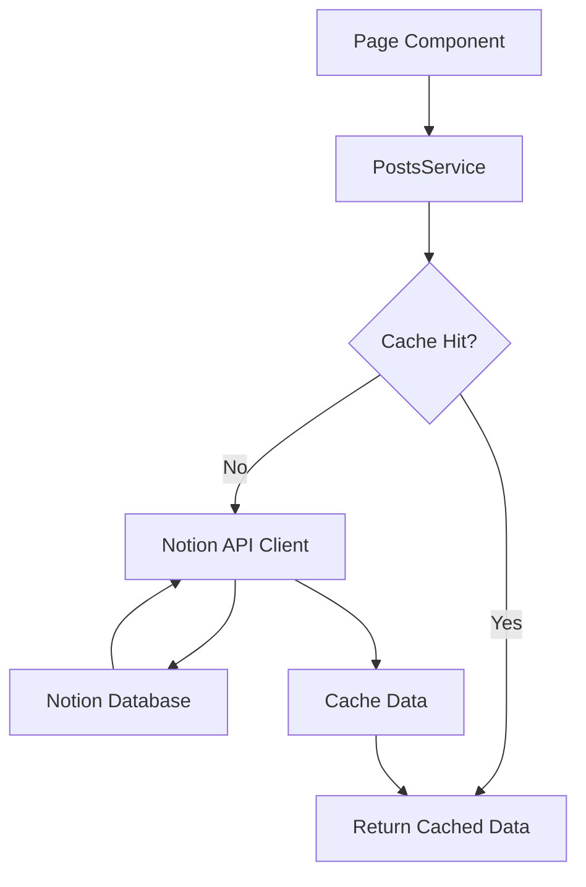

# Notion API Integration

Notion API를 활용한 블로그 데이터 페칭 전략 문서입니다.

---

## 1. 개요

| 항목 | 값 |
|------|-----|
| **API 버전** | v2025-09-03 |
| **클라이언트** | `@notionhq/client` |
| **핵심 파일** | `src/lib/services/posts.service.ts` |
| **패턴** | Service Layer Pattern |

---

## 2. 환경 변수

```bash
NOTION_API_KEY=secret_xxx                  # Notion Integration Token
NOTION_POSTS_DATA_SOURCE_ID=xxx            # Posts Database Source ID
NOTION_COMMENTS_DATA_SOURCE_ID=xxx         # Comments Database Source ID
```

---

## 3. 핵심 타입 (`BlogPost`)

```typescript
export type BlogPost = {
  id: string;
  slug: string;            // URL 라우팅용 (가독성 높은 ID)
  title: string;
  date: string;
  tags: string[];
  cover: string | null;
  description: string;
  group?: string;
  part?: string;
  language?: string;       // 'KR' | 'EN'
  translationId?: string | null;
  viewCount?: number;
};
```

---

## 4. 주요 함수 (`posts.service.ts`)

### 4.1 `getCachedAllPosts()`
- **역할**: 모든 게시물을 Notion에서 가져와 캐시
- **캐시 키**: `['all-posts-v4']`
- **캐시 시간**: 1시간 (3600초)

### 4.2 `getPublishedPosts(options)`
- **역할**: 필터링된 게시물 목록 반환
- **Options**: `tag`, `searchQuery`, `group`, `locale`
- **로직**: 캐시된 전체 게시물에서 메모리 상 필터링 수행

### 4.3 `getPostBySlug(slug)` [NEW]
- **역할**: Slug(문자열 ID)로 단일 게시물 조회
- **특징**: `getCachedAllPosts` 결과를 검색하여 일치하는 Slug를 찾음
- **캐시 키**: `['post-by-slug-v4']`

### 4.4 `incrementViewCount(pageId)`
- **역할**: 조회수 증가 (Notion API 직접 호출, 캐시 없음)

---

## 5. 데이터 흐름 (Service Pattern)



---

## 6. 라우팅 전략

- **기존**: `/app/[id]` (Notion UUID 사용)
- **변경**: `/app/[slug]` (Notion UUID 사용하되, slug 파라미터로 취급)
  - 현재는 Slug와 ID가 동일하지만, 추후 커스텀 Slug 도입을 대비한 구조
